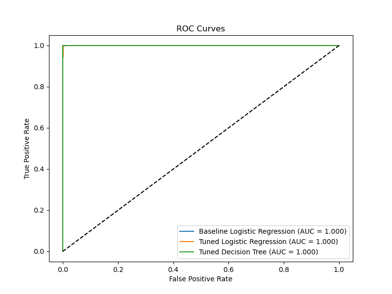

# Unlocking Future Stars: Predicting High-Potential Football Players with Machine Learning

## PROJECT OVERVIEW

Smart scouting is pretty important, especially if it's outshining a big budget .Sifting through thousands of young players worldwide, all while working with a tight budget, can be quite a challenge. You need to know: Which of these kids will grow into a world-class player? Miss a future star, and you lose a chance to build a legacy. Sign the wrong player, and you waste millions. It’s a high-stakes gamble, and the pressure is on.

That’s where my project comes in. I’ve harnessed the power of data science to act like your ultimate scouting assistant. Using a massive dataset from the FIFA 21 game, packed with details on over 18,000 players—think skills, market value, and more—I’ve built a tool to predict which young players, aged 23 or under, have what it takes to reach the elite level, like a Lionel Messi or Kylian Mbappé. The model doesn’t just guess; it learns patterns from the data to spot players with that special potential, even if they’re flying under the radar. 

**.** Source: fifa21_raw_data.csv from the FIFA 21 video game in Kaggle, containing player attributes for ~18,000 players.

##  OBJECTIVES

The key objectives to be achieved by this study are as follows:

1. **Find Young Players Who Can Become Stars**: Build a tool to predict which players aged 23 or younger will likely reach an elite level (Overall Rating ≥ 80), helping the club spot future top performers early.

2. **Save Money and Time in Scouting**: Create a model that shortlists the most promising players, so the scouting team can focus on the best targets without wasting resources on less likely prospects.

3. **Give the Club a Competitive Edge**: Use data to identify undervalued players before bigger clubs notice them, allowing the club to sign talent at a lower cost and build a stronger team.

### Key columns used:
**↓OVA (Overall Rating)**: Current skill level (0–100), a key predictor of elite potential.

**POT (Potential Rating)**: Maximum future rating (0–100), used to create High_Potential.

**Value**: Market value in euros (e.g., €5M), reflecting market demand.

**Wage**: Weekly wage in euros (e.g., €10K), indicating current recognition.

**Attacking**: Score of attacking skills (e.g., Crossing, Finishing).

**Skill**: Score of technical skills (e.g., Dribbling, Ball Control).

**Movement**: Score of speed and agility (e.g., Sprint Speed, Acceleration).

**Power**: Score of physical attributes (e.g., Strength, Stamina).

**Mentality**: Score of mental attributes (e.g., Vision, Composure).

**Defending**: Score of defensive skills (e.g., Tackling, Marking).

**W/F (Weak Foot)**: Weaker foot ability (1–5), indicating versatility.

**SM (Skill Moves)**: Dribbling tricks ability (1–5), reflecting flair.

**A/W (Attacking Work Rate)**: Effort in attack (Low, Medium, High).

**D/W (Defensive Work Rate)**: Effort in defense (Low, Medium, High).

**IR (International Reputation)**: Global fame (1–5).

**Height**: Height in inches, affecting physical presence.

**Weight**: Weight in pounds, influencing strength.

**foot**: Preferred foot (Left = 0, Right = 1).

These columns were cleaned (e.g., converting Value to numeric) and used as features to predict High_Potential.

### Methodology:
**.** Data Preparation: Cleaned the FIFA 21 dataset, filtered for players aged ≤ 23, and created the High_Potential target.

**.** Exploratory Data Analysis (EDA): Analyzed distributions (e.g., Age, Value) and correlations (e.g., ↓OVA with Value).

**.** Modeling: Built three models:

**(a)** Baseline Logistic Regression (simple, interpretable).

**(b)** Tuned Logistic Regression (optimized with class weights, expanded hyperparameters: C, solver, penalty).

**(c)** Tuned Decision Tree (tuned max_depth, min_samples_split).

**.** Evaluation: Focused on Recall (~85% for Tuned Logistic Regression) to catch high-potential players, with ROC-AUC (~0.91) for class separation.

**.** Player Ranking: Generated with predicted probabilities to prioritize high-potential players.

Evaluation: Used Recall as the primary metric to minimize missing high-potential players, supported by ROC-AUC and classification reports. Visualized performance with ROC curves.

Player Ranking: Generated player_ranking.csv with predicted probabilities to prioritize prospects.

### Key Outcomes:

**-** All models achieved high performance, with ROC curves indicating strong classification ability.

**-** The model shortlists high-potential players, enabling targeted scouting.

**-** Outputs include a cleaned dataset (fifa21_cleaned_data.csv) for Tableau visualization and a ranked player list (player_ranking.csv).

### Recommendations for the 2025–2026 Season

**1.** Target Top Prospects: Scout the top 20 players from the analyzed data with probabilities ≥ 0.8. Arrange trials or review footage in July 2025.

**2.** Focus on Skills: Prioritize players with Dribbling ≥ 75 and strong Skill scores for attacking and midfield roles.

**3.** Sign Young Talent: Negotiate for players aged 18–20 with Value ≤ €5M (e.g., €3M, probability ≥ 0.75) for long-term value.

**4.** Streamline Scouting: Use video tools (e.g., Wyscout) to evaluate the top 50 players, then scout the top 10–15 in person.

**5.** Scout Lower Leagues: Visit leagues like the Eredivisie to find players with low IR and high Skill Moves (SM ≥ 4).

**6.** Pilot the Model: Sign 2–3 top-ranked players in July 2025, track their performance, and update the model with new data in January 2026.

